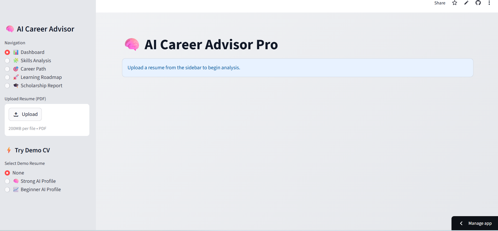

# 🚀 **AI Career Advisor Pro**



## 🚀 Live Demo

👉 https://ai-career-advisor-fadil-ade.streamlit.app/

---

## 📌 Overview

**AI Career Advisor Pro** is an intelligent web application that analyzes resumes (PDF) and provides:

* 📊 AI readiness score
* 🧩 Skill detection (AI + soft skills)
* 🎯 Career path matching
* 🚀 Personalized learning roadmap
* 🎓 Scholarship readiness insights

It helps users understand **where they stand** and **how to reach AI careers step-by-step**.

---

## ⚡ Features

* 📄 Upload your resume (PDF)
* 🧠 AI-powered skill analysis
* 📊 Smart scoring system (0–100)
* 🎯 Career recommendations (Data Scientist, ML Engineer, etc.)
* 🧩 Skill gaps detection
* 🚀 Structured 90-day roadmap
* 🎓 Scholarship readiness evaluation
* ⚡ Demo CV mode (instant testing)

---

## 🛠️ Tech Stack

* Python
* Streamlit
* PyPDF2
* NLTK
* streamlit-pdf-viewer

---

## 📂 Project Structure

```
ai-career-advisor/
│
├── app.py
├── analyzer.py
├── utils.py
├── requirements.txt
│
├── demo_cvs/
│   ├── beginner_cv.pdf
│   └── expert_cv.pdf
│
└── screenshot.png
```

---

## ▶️ Run Locally

```bash
pip install -r requirements.txt
streamlit run app.py
```

---

## 💡 Use Cases

* Students preparing for AI careers
* Beginners learning Data Science
* Resume evaluation before applying
* Scholarship / internship preparation

---

## 🎯 Future Improvements

* Resume rewriting with AI
* GPT-based feedback
* Real job matching (LinkedIn API)
* Portfolio scoring (GitHub integration)

---

## 👤 Author

**Fadil ADE (FDL Flow)**
AI Enthusiast | Future Data Scientist | Builder

---

## ⭐ Support

If you like this project, give it a ⭐ on GitHub!
